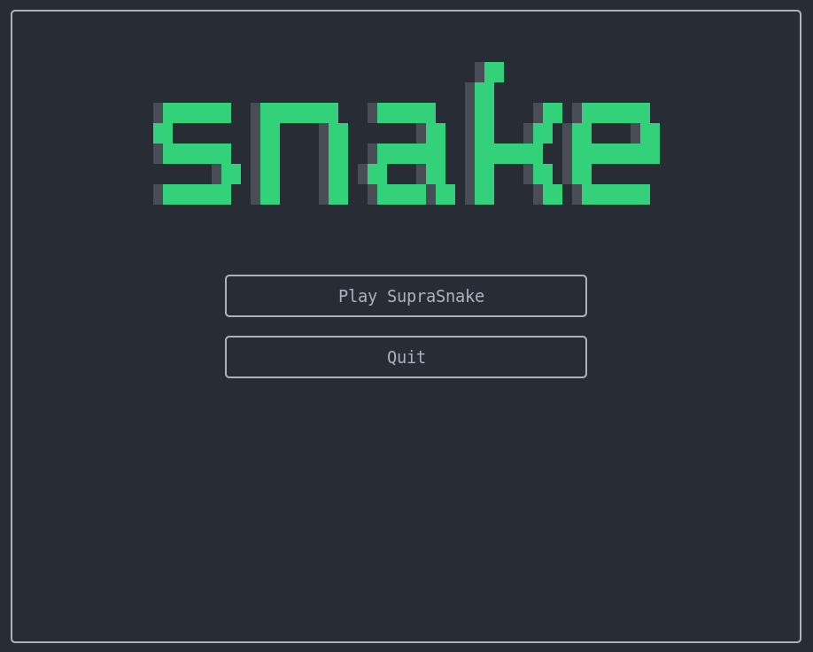
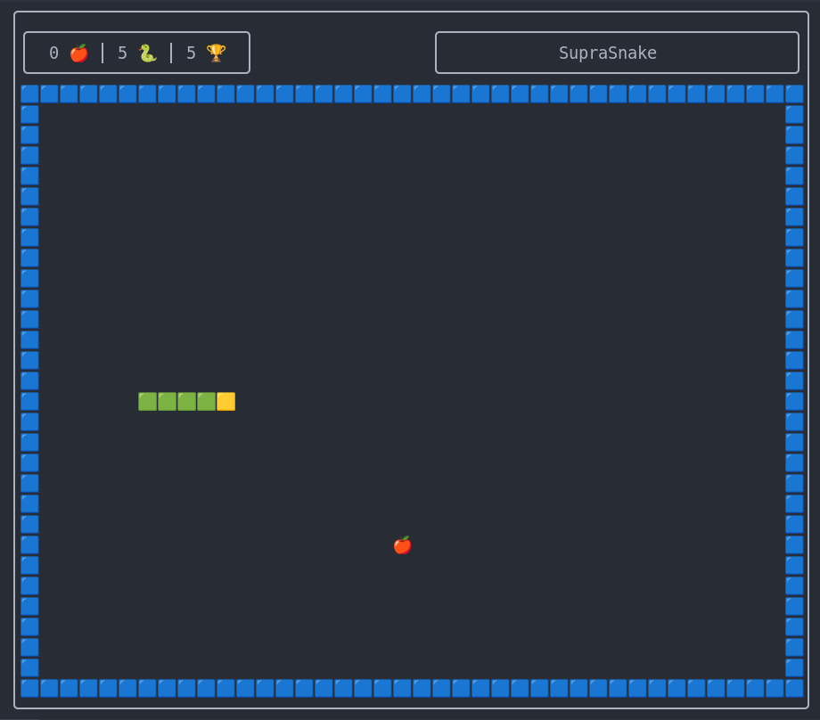

# Vim SupraSnake 🐍

Un simple jeu de Snake écrit en **Vim9script**.
Jouez à Snake directement dans votre Vim !





## Utilisation

- Installez le plugin avec votre gestionnaire de plugins préféré.
- Lancez la commande :

```vim
:Snake
```

Profitez du jeu dans votre éditeur. 🎮

## Prérequis

- Vim 9.0 ou version supérieure

## Contrôles

→ Déplacer le serpent (haut / bas / gauche / droite)

→ Démarrer ou recommencer une partie (Entrée)

→ Quitter le jeu (Échap)
